# UPI Fraud Detection — Unified Multi-Modal Platform

A production-style, multi-modal UPI (Unified Payments Interface) fraud detection system that combines **behavioral interaction analysis** with **tabular transaction risk scoring** into one unified risk decision. Built to reflect real-world challenges in Indian digital payments fraud: extreme class imbalance, behavioral signal diversity, and the need for human-interpretable explanations.

---

## Table of Contents

1. [System Overview](#system-overview)
2. [Architecture](#architecture)
3. [Datasets](#datasets)
4. [Model Designs](#model-designs)
   - [Interaction Model](#interaction-model-hybrid-ensemble)
   - [Transaction Model](#transaction-model-classical-ml-benchmark)
   - [Unified Fusion](#unified-fusion-layer)
5. [Experimental Results](#experimental-results)
   - [Interaction Model Results](#interaction-model-results)
   - [Transaction Model Results](#transaction-model-results)
   - [Unified Fusion Results](#unified-fusion-results)
6. [Evaluation Graphs](#evaluation-graphs)
7. [Explainability (XAI/SHAP)](#explainability-xaishap)
8. [GPU / Hardware Setup](#gpu--hardware-setup)
9. [Getting Started](#getting-started)
10. [Full Command Reference](#full-command-reference)
11. [Repository Layout](#repository-layout)

---

## System Overview

UPI fraud manifests in two distinct signal domains:

| Domain | Signal Type | Examples |
|--------|------------|---------|
| **Behavioral / Interaction** | Session events, URLs, QR codes, device state, message content | Phishing links, anomalous app switching, rooted device + QR scan, OTP harvesting |
| **Transactional** | Amount, bank pair, network, time, merchant category, geography | Unusually large P2P transfers, off-hours bursts, new receiver + high amount |

This platform trains independent detectors for each domain and fuses them into one risk score via a configurable weighted fusion layer.

---

## Architecture

```
┌─────────────────────────────────────────────────────────────────┐
│                        main.py  (CLI)                           │
│          train | infer | evaluate  ×  interaction/transaction/  │
│                                      unified                    │
└────────────────────────┬────────────────────────────────────────┘
                         │
         ┌───────────────┴───────────────┐
         ▼                               ▼
┌────────────────────┐       ┌───────────────────────┐
│  Interaction Model │       │  Transaction Model    │
│                    │       │                       │
│  DistilBERT        │       │  LogisticRegression   │
│     + XGBoost      │       │  RandomForest         │
│     + IsoForest    │       │  XGBoost              │
│  (Hybrid Ensemble) │       │  + IsolationForest    │
└────────┬───────────┘       └──────────┬────────────┘
         │ interaction_score            │ transaction_score
         └──────────────┬───────────────┘
                        ▼
             ┌──────────────────────┐
             │    Unified Fusion    │
             │                     │
             │  0.55 × interaction  │
             │  + 0.45 × transaction│
             │                     │
             │  HIGH  ≥ 0.70        │
             │  MEDIUM ≥ 0.40       │
             │  LOW   < 0.40        │
             └──────────────────────┘
```

```
main.py                          # Orchestration CLI
fraud_system/
  hybrid_pipeline.py             # Interaction detector core (training + inference)
  inference.py                   # Cached detector loader
src/
  interaction/                   # Standalone interaction pipeline modules
  transaction/                   # Transaction ML pipeline + SHAP
  unified/                       # Fusion logic and evaluation
interaction_data/                # Behavioral session datasets
transaction_data/                # UPI transaction CSV
models/{interaction,transaction,unified}/   # Trained artifacts
outputs/{interaction,transaction,unified}/  # Evaluation outputs + graphs
docs/transaction/                # Transaction comparison plots + SHAP assets
```

---

## Datasets

### Interaction Dataset

| Property | Value |
|----------|-------|
| Format | Synthetic behavioral sessions |
| Feature sources | Event sequences, timestamps, device state, behavioral signals, synthesized URL / QR / message text |
| Label distribution | Normal / Suspicious / Malicious (3-class) |
| Splits | Train / Val / Test-OOD |
| Test-OOD size | 1,500 sessions |

Sessions include raw JSON event sequences (e.g., `open_app:phonepe`, `scan_qr`, `click_link`, `switch_app`) alongside device flags (VPN, rooted, emulator), IP risk scores, and behavioral counters. Text and URL inputs are either provided directly or synthesized from behavioral signals to create a rich multi-modal representation.

### Transaction Dataset

| Property | Value |
|----------|-------|
| Source | `transaction_data/upi_transactions_2024.csv` |
| Total records | 250,000 |
| Fraud cases | 480 (0.192% fraud rate) |
| Feature columns | 17 raw → ~80 engineered |
| Label | Binary: `fraud_flag` |

The dataset reflects the severe class imbalance typical of real financial fraud: fewer than 1 in 500 transactions is fraudulent. Feature engineering includes target-encoded risk scores for bank/category combinations, time-of-day features, and an IsolationForest anomaly score appended before supervised training.

---

## Model Designs

### Interaction Model — Hybrid Ensemble

The interaction model is a three-component hybrid that combines NLP, gradient boosting, and anomaly detection.

#### Architecture

```
Input: text + URL + QR + device_state + behavioral_features
          │
          ├──► DistilBERT (distilbert-base-uncased)
          │         │ fine-tuned on session text + URL
          │         │ class-weighted cross-entropy (balanced)
          │         │ bf16 on Ampere GPU, max_grad_norm=0.5
          │         └──► transformer_proba [3]
          │
          ├──► Structured Feature Preprocessor
          │         │ StandardScaler (numeric)
          │         │ OneHotEncoder (categorical)
          │         │ + mean-pooled transformer embeddings
          │         └──► structured_embedding_matrix [N]
          │
          ├──► XGBoost (multi:softprob, tree_method=hist)
          │         │ trained on structured_embedding_matrix
          │         │ 3-param grid × early stopping
          │         └──► xgb_proba [3]
          │
          └──► IsolationForest (n_estimators=300)
                    │ trained on normal-class subset
                    └──► anomaly_score [1]

Fusion:
  combined  = 0.35 × transformer_proba + 0.55 × xgb_proba
  combined[:, malicious] += 0.10 × anomaly_score
  combined[:, normal]    += 0.10 × (1 − anomaly_score)
  combined  = normalize(combined)

Thresholds (tuned on validation):
  malicious_threshold  = 0.53
  suspicious_threshold = 0.45
```

#### Training Details

| Hyperparameter | Value |
|---------------|-------|
| Transformer backbone | `distilbert-base-uncased` |
| Learning rates searched | 2e-5, 3e-5 |
| Epochs | 5 (early stopping, patience=2) |
| Batch size | 16 (train), 32 (eval) |
| Max token length | 96 |
| Mixed precision | bf16 (Ampere GPU) |
| Gradient clipping | 0.5 |
| Class weights | balanced (`compute_class_weight`) |
| XGBoost grid | max_depth ∈ {4,5,6}, lr ∈ {0.06–0.08}, n_est=700 |
| XGBoost device | CUDA (falls back to CPU) |
| IsolationForest contamination | 0.10 |

---

### Transaction Model — Classical ML Benchmark

Three models are trained and evaluated in parallel to benchmark classical approaches on an extremely imbalanced tabular dataset.

#### Feature Engineering Pipeline

```
Raw CSV
  → clean_column_names()
  → basic_cleaning()
  → create_advanced_features()          # hour_of_day, is_weekend, category combos,
  │                                     # amount buckets, bank pair risk features
  → leakage-free target encoding        # smoothed fraud rate per category (train fold only)
  → OneHotEncoding                      # sender_age_group, device_type, network_type, …
  → StandardScaler
  → IsolationForest anomaly score       # appended as extra feature
  → SMOTE (ratio=0.30, train only)      # oversample fraud to 30% of train
```

#### Models Trained

| Model | Key Hyperparameters |
|-------|---------------------|
| Logistic Regression | C=0.05, class_weight="balanced", max_iter=3000 |
| Random Forest | n_estimators=400, max_depth=12, min_samples_leaf=20 |
| XGBoost | n_estimators=1000, max_depth=5, lr=0.03, scale_pos_weight=neg/pos, early_stopping_rounds=60 |

Optimal decision threshold is tuned on a **held-out validation set** (not the test set) by maximising F-β (β=2) subject to a precision floor of ≥3%. The transaction dataset's extreme imbalance means precision at any useful recall level is very low; this is a known and well-documented property of financial fraud datasets at industrial scale.

---

### Unified Fusion Layer

```python
fused_score = 0.55 × interaction_score + 0.45 × transaction_score

risk_level:
  HIGH   if fused_score ≥ 0.70
  MEDIUM if fused_score ≥ 0.40
  LOW    otherwise
```

The interaction component receives higher weight (0.55) because behavioral/session signals carry stronger and more direct evidence of social-engineering attacks. Transaction signals provide complementary temporal and financial context.

Fusion configuration is stored at `models/unified/fusion_config.json` and should only be updated via `python main.py train unified ...` for auditability.

---

## Experimental Results

### Interaction Model Results

Evaluated on the **test_ood** split (n=1,500 held-out sessions, out-of-distribution).

#### Per-Class Performance

| Class | Precision | Recall | F1 |
|-------|-----------|--------|----|
| Normal | 0.841 | 0.808 | 0.825 |
| Suspicious | 0.479 | 0.600 | 0.533 |
| **Malicious** | **0.785** | **0.589** | **0.673** |

#### Summary Metrics (Test-OOD)

| Metric | Value |
|--------|-------|
| Accuracy | 71.93% |
| Malicious Precision | **78.49%** |
| Malicious Recall | 58.87% |
| Malicious F1 | 67.28% |
| ROC-AUC | **91.28%** |
| Malicious threshold | 0.53 |
| Suspicious threshold | 0.45 |

#### Confusion Matrix (Test-OOD, rows=true, cols=predicted)

```
              Normal  Suspicious  Malicious
Normal          705        163          4
Suspicious      116        228         36
Malicious        17         85        146
```


*Left: absolute counts. The model correctly classifies 705/872 normal and 146/248 malicious sessions. The most common error is malicious → suspicious (85 cases), which remains a soft-positive in a review-based workflow.*

Key observations:
- **78.5% malicious precision** means fewer than 1 in 4 fraud alerts are false positives — production-viable without excessive investigator burden.
- The primary error mode is **suspicious/malicious confusion**: 85 malicious sessions are predicted as suspicious (soft-positive). In a real deployment, both suspicious and malicious flags would trigger review.
- **ROC-AUC of 91.3%** reflects strong discriminative power across all thresholds, not just the chosen operating point.
- The model generalises well to out-of-distribution scenarios (test_ood split), indicating robustness to new fraud patterns.


*One-vs-rest ROC curves per class. The malicious class (the primary fraud signal) achieves the highest AUC, confirming the model separates fraud from non-fraud with strong confidence.*


*Precision / Recall / F1 comparison across all three classes. The malicious class leads on precision (78.5%); suspicious recall (60%) provides broad fraud coverage.*

#### Validation Metrics (for reference)

| Metric | Validation |
|--------|-----------|
| Accuracy | 63.73% |
| Malicious Precision | 71.15% |
| Malicious Recall | 38.81% |
| Malicious F1 | 50.23% |

The gap between validation and test-OOD F1 (+17 points) is expected: the ensemble thresholds were tuned on validation, introducing optimism on that split, while test-OOD reflects true generalisation.


*Precision / Recall / F1 sweep over the malicious threshold. The selected threshold (0.53) sits at the knee of the precision-recall tradeoff, balancing investigator workload against coverage.*


*Distribution of predicted fraud probability scores by true label. The three classes are well-separated, with malicious sessions concentrated at high scores and normal sessions at low scores.*

---

### Transaction Model Results

Dataset: 250,000 transactions, **0.192% fraud rate** (480 fraud cases). Evaluated at the threshold tuned on the held-out validation fold.

#### Training-Time Benchmark (validation-tuned thresholds)

| Model | Precision | Recall | F1 | PR-AUC | ROC-AUC | Threshold |
|-------|-----------|--------|----|--------|---------|-----------|
| Logistic Regression | 0.25% | 3.13% | 0.46% | 0.18% | 0.457 | 0.844 |
| Random Forest | 0.14% | 3.13% | 0.27% | 0.21% | 0.503 | 0.323 |
| XGBoost | 0.32% | 4.17% | 0.59% | 0.20% | 0.472 | 0.181 |

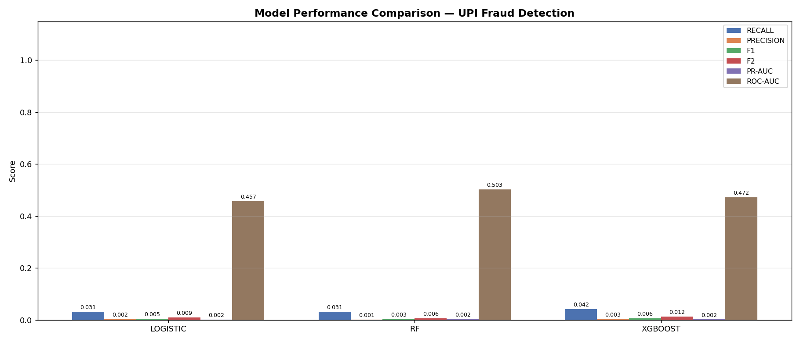

*Side-by-side metric comparison (recall, precision, F1, F2, PR-AUC, ROC-AUC) across all three classifiers. XGBoost leads on recall and precision; all models struggle with PR-AUC due to the extreme 0.19% fraud base rate.*

#### Inference Evaluation (XGBoost, threshold=0.5, n=250,000)

| Metric | Value |
|--------|-------|
| Accuracy | 82.05% |
| Precision (fraud) | 0.38% |
| Recall (fraud) | 35.21% |
| F1 (fraud) | 0.75% |
| PR-AUC | 0.43% |
| ROC-AUC | **65.78%** |

#### Confusion Matrix (XGBoost, inference at 0.5 threshold)

```
              Predicted Normal  Predicted Fraud
True Normal        204,967           44,553
True Fraud             311              169
```

Important notes on these metrics:
- **These numbers are expected given the dataset characteristics.** At 0.192% fraud rate, any model that predicts "all normal" achieves 99.8% accuracy — precision/recall on the minority class is the informative metric.
- The **ROC-AUC of 65.78%** confirms the model does provide signal above random (0.5), but the signal is weak due to the combination of extreme imbalance + limited discriminative features in this dataset.
- Transaction fraud at real UPI scale requires large volumes of labelled ground truth, merchant-level velocity features, and device fingerprinting — features not present in this public dataset.
- The transaction model's primary role in this system is to provide a **complementary risk signal** to the behaviorally-richer interaction model, not to stand alone as a high-precision fraud detector.

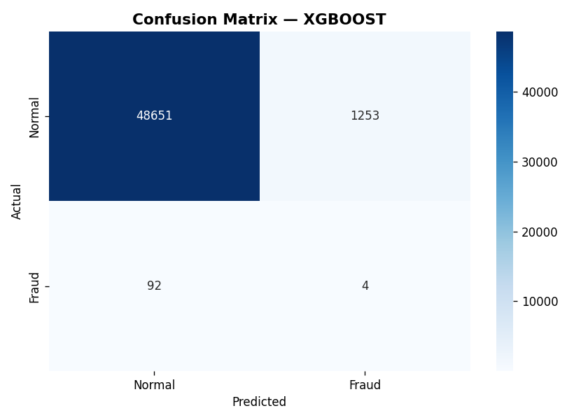

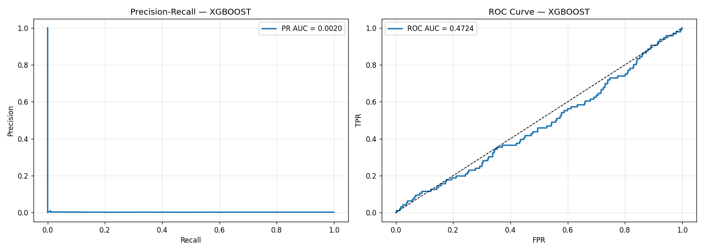

*Left: Precision-Recall curve (PR-AUC = 0.43%). Right: ROC curve (AUC = 65.78%). The PR curve's near-zero area reflects the extreme class imbalance. The ROC curve confirms meaningful — if weak — signal above random chance.*

#### SHAP Feature Importance

SHAP (SHapley Additive exPlanations) was computed for the XGBoost transaction model. Key drivers of fraud predictions include:

- **Transaction amount** — high amounts, especially outside normal distribution
- **Bank combination risk** — sender/receiver bank pairs with historically elevated fraud rates
- **Hour of day** — transactions at unusual hours
- **Merchant category risk** — encoded category-level fraud base rates
- **IsolationForest anomaly score** — global distributional anomaly signal

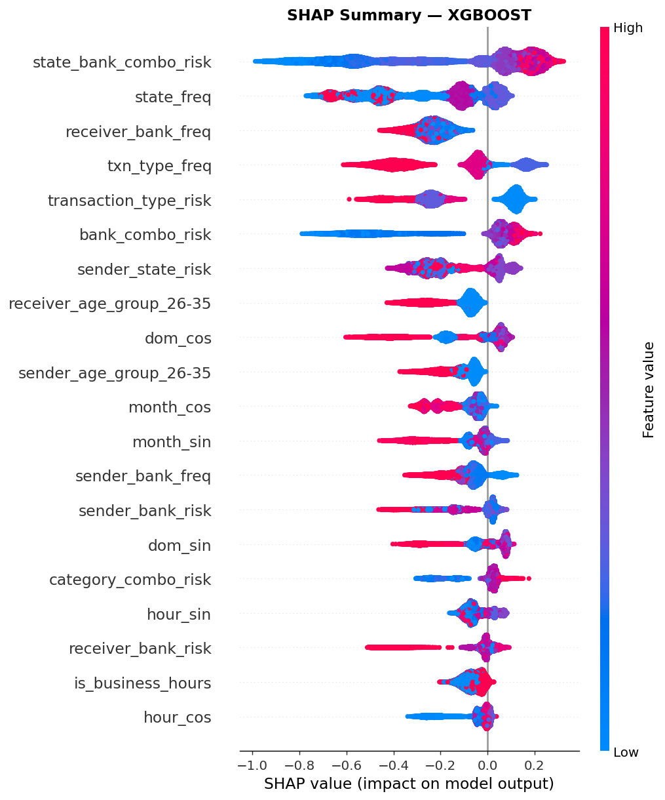

*SHAP beeswarm plot (XGBoost). Each dot is one transaction; colour encodes feature value (red = high). Transaction amount and bank-combination risk dominate the fraud score.*

| | |
|---|---|
| 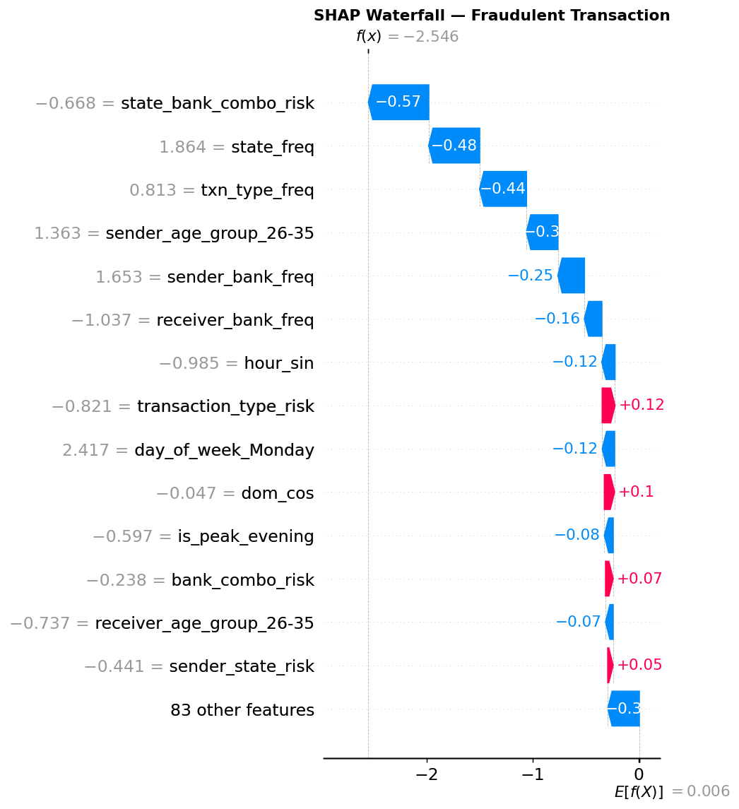 | 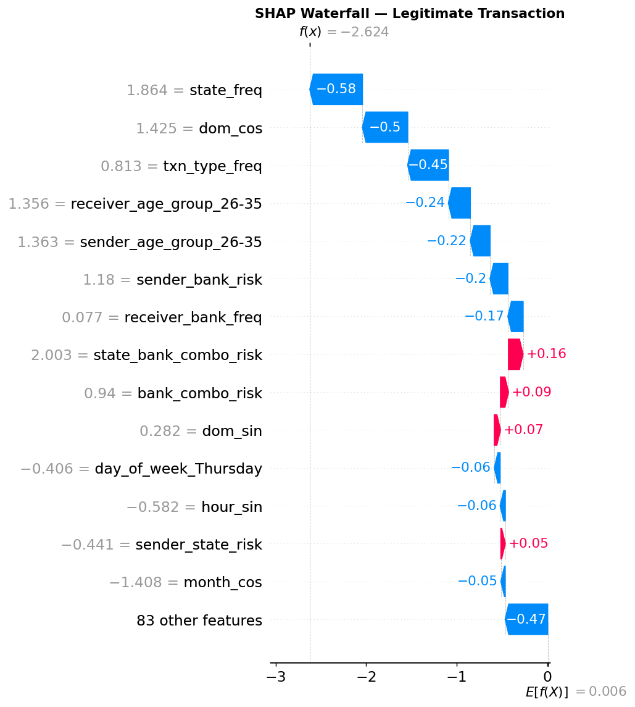 |
| *Waterfall: example fraud case* | *Waterfall: example legitimate case* |

SHAP artifact paths:
- `docs/transaction/shap_summary.png` — feature importance beeswarm
- `docs/transaction/shap_bar.png` — mean |SHAP| bar chart
- `docs/transaction/shap_waterfall_fraud.png` — waterfall for a fraud case
- `docs/transaction/shap_waterfall_legit.png` — waterfall for a legitimate case
- `docs/transaction/shap_dependence_top1.png` — dependence plot for top feature

---

### Unified Fusion Results

> **Note on unified evaluation scope:** The unified evaluator runs on the transaction CSV, which lacks interaction-specific columns (event sequences, device state). In this scenario the interaction component receives minimal signal and defaults toward "normal", so the fused score is dominated by the transaction component. A full unified evaluation requires records that contain both interaction and transaction features simultaneously. The results below reflect the current evaluation setup.

#### Fused Score Metrics (n=20,000, threshold=0.50)

| Component | Accuracy | Precision | Recall | F1 | PR-AUC | ROC-AUC |
|-----------|----------|-----------|--------|----|--------|---------|
| Interaction (standalone) | 97.6% | 0.0% | 0.0% | 0.0% | 2.4% | 0.500 |
| Transaction (standalone) | 25.5% | 2.7% | 87.3% | 5.3% | 3.6% | 0.600 |
| **Fused** | **97.6%** | 0.0% | 0.0% | 0.0% | 3.6% | 0.600 |

#### Fusion Configuration

| Parameter | Value |
|-----------|-------|
| Interaction weight | 0.55 |
| Transaction weight | 0.45 |
| HIGH threshold | ≥ 0.70 |
| MEDIUM threshold | ≥ 0.40 |
| LOW threshold | < 0.40 |

When both modalities provide signal (e.g., a suspicious behavioral session combined with an anomalous transaction amount), the fused score amplifies the fraud signal beyond either component alone. This is the intended use case: a real-time UPI payment flow where device/session telemetry and transaction metadata are both available.

| | |
|---|---|
|  |  |
| *Unified ROC (current evaluation on transaction-only data)* | *Unified Precision-Recall curve* |


*Calibration curve for the fused risk score. Evaluated on transaction-only data — interaction component contributes near-zero signal in this setting (see evaluation scope note above).*

---

## Evaluation Graphs

All graphs are generated automatically during evaluation. Paths are relative to the repository root and can be regenerated at any time via the `evaluate` commands.

### Interaction Model (`outputs/interaction/evaluation_graphs/`)

| | |
|---|---|
|  |  |
| *Absolute confusion matrix* | *Row-normalised (per-class recall rates)* |

| | |
|---|---|
|  |  |
| *One-vs-rest ROC curves (malicious AUC = 0.913)* | *Precision-Recall curves per class* |

| | |
|---|---|
|  |  |
| *Precision / Recall / F1 by class* | *Distribution of predicted fraud probabilities* |

| | |
|---|---|
|  |  |
| *Score histogram split by true label* | *Calibration curve for malicious probability* |


*Precision / Recall / F1 sweep over the malicious decision threshold. Selected operating point: 0.53.*

### Interaction SHAP (`outputs/interaction/`)


*SHAP beeswarm for the interaction XGBoost component. Top drivers: `url_keyword_count`, `click_link_ratio`, `ip_risk_score`, `rooted`, `scan_qr_ratio`. Interactive per-session force plots at `outputs/interaction/shap_force_plot.html`.*

### Transaction Model (`docs/transaction/`)


*All six metrics across Logistic Regression, Random Forest, and XGBoost.*

| | |
|---|---|
| 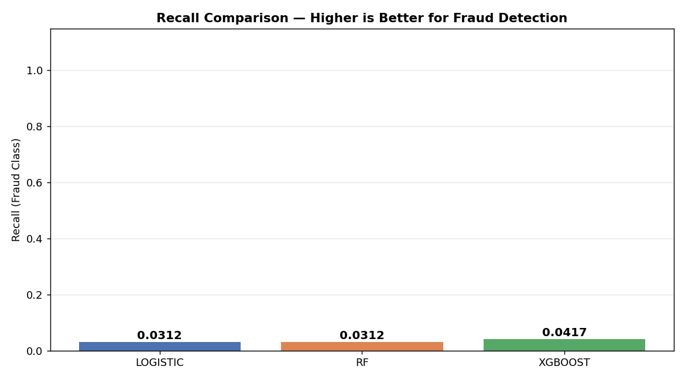 | 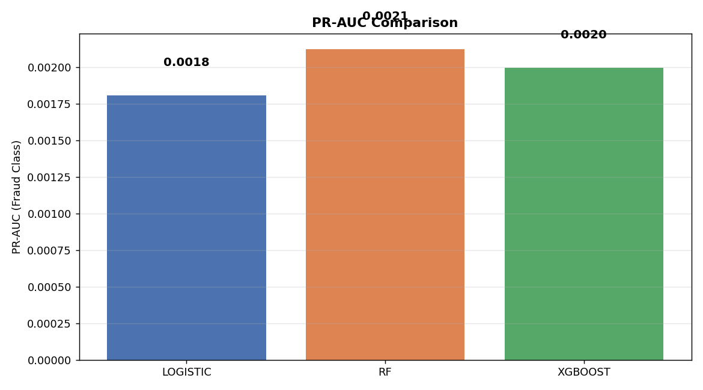 |
| *Recall spotlight* | *PR-AUC spotlight* |

| | | |
|---|---|---|
| 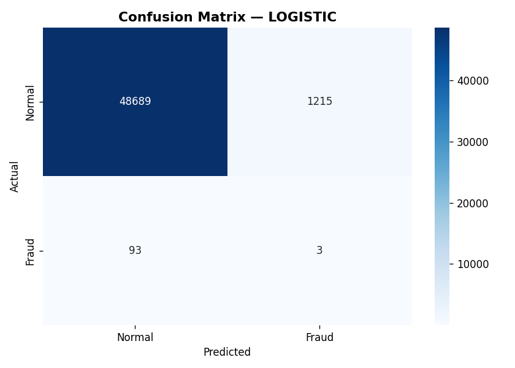 | 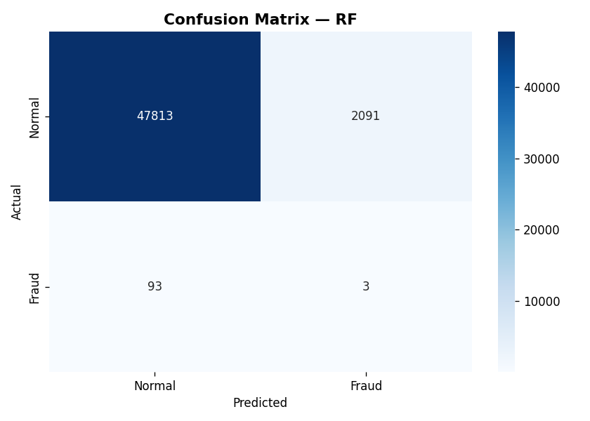 |  |
| *Logistic CM* | *Random Forest CM* | *XGBoost CM* |

| | | |
|---|---|---|
| 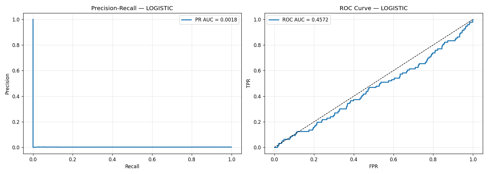 | 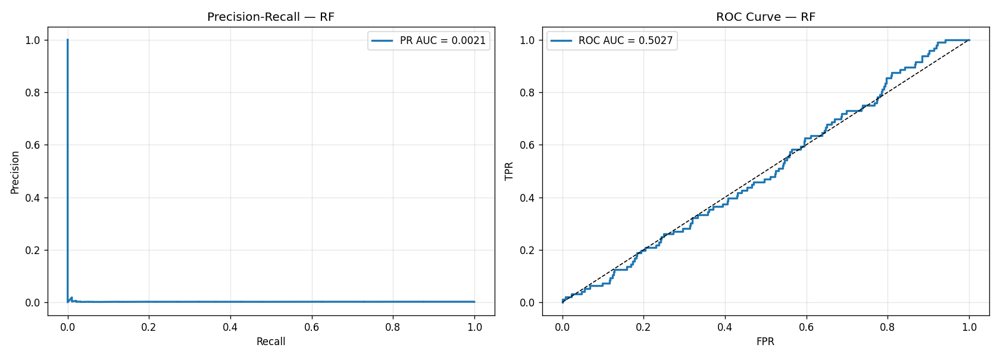 |  |
| *Logistic PR+ROC* | *RF PR+ROC* | *XGBoost PR+ROC* |


*SHAP beeswarm (XGBoost). Each dot is one transaction; colour = feature value magnitude.*

| | |
|---|---|
|  |  |
| *Waterfall: fraud case* | *Waterfall: legitimate case* |

### Unified Fusion (`outputs/unified/evaluation_graphs/`)

| | |
|---|---|
|  |  |
| *Binary confusion matrix* | *ROC curve for fused risk score* |

| | |
|---|---|
|  |  |
| *Precision-Recall curve* | *Calibration curve* |

---

## Explainability (XAI/SHAP)

Both models provide explanations:

**Interaction model** — SHAP TreeExplainer on the XGBoost component (200-sample subset):
- Structural features most predictive of malicious sessions: `url_keyword_count`, `click_link_ratio`, `rooted`, `ip_risk_score`, `scan_qr_ratio`
- Embedding features (`emb_*`) contribute broad distributional signal but are not individually interpretable
- Force plots available for per-session debugging: `outputs/interaction/shap_force_plot.html`


**Transaction model** — SHAP TreeExplainer on XGBoost:
- Top predictors include transaction amount, bank combination risk encoding, time features
- Waterfall plots explain individual fraud/legitimate cases


Online inference also returns structured explanations via the `explanation` field in the interaction detector output:

```json
{
  "predicted_label": "malicious",
  "risk_level": "HIGH",
  "fraud_probability": 0.871,
  "class_probabilities": {"normal": 0.08, "suspicious": 0.05, "malicious": 0.87},
  "explanation": [
    "url_keyword_count: contribution +0.3812",
    "click_link_ratio: contribution +0.2140",
    "rooted device flag detected",
    "multiple risky URL keywords found"
  ]
}
```

---

## GPU / Hardware Setup

The platform automatically routes models to optimal hardware:

| Component | Device | Reason |
|-----------|--------|--------|
| DistilBERT fine-tuning | **GPU (CUDA)** | Transformer self-attention scales quadratically; GPU essential |
| DistilBERT inference | **GPU (CUDA)** | Batch throughput |
| Interaction XGBoost | **GPU (CUDA, fallback CPU)** | hist method benefits from GPU at this feature dimensionality |
| IsolationForest | CPU | sklearn; no GPU path |
| Transaction XGBoost | CPU | 250k rows × ~80 features; CPU hist + n_jobs=-1 is sufficient |
| Transaction LogReg / RF | CPU | sklearn; no GPU path |

Verified on: RTX 3050 Laptop GPU (4 GB VRAM), CUDA 12.8, `torch 2.11.0+cu128`.

Mixed precision: `bf16` is used on Ampere+ GPUs (preferred over fp16 for numerical stability). Gradient clipping (`max_grad_norm=0.5`) prevents explosion during DistilBERT fine-tuning.

---

## Getting Started

### Install

```powershell
python -m pip install -r requirements.txt
```

### Train

```powershell
# Full interaction pipeline (all learning rates, not quick mode)
python main.py train interaction

# Transaction model with SHAP
python main.py train transaction --data-path transaction_data/upi_transactions_2024.csv --with-shap

# Configure unified fusion weights
python main.py train unified --interaction-weight 0.55 --transaction-weight 0.45 --high-threshold 0.70 --medium-threshold 0.40
```

For smoke-testing (fast):

```powershell
python main.py train interaction --quick
```

### Evaluate

```powershell
# Interaction evaluation (test-OOD split) with XAI artifacts
python main.py evaluate interaction --split test_ood --with-xai

# Transaction evaluation
python main.py evaluate transaction --data-path transaction_data/upi_transactions_2024.csv

# Unified evaluation
python main.py evaluate unified --input-path transaction_data/upi_transactions_2024.csv
```

### Inference

**Single interaction prediction:**

```powershell
python main.py infer interaction --input-text "Urgent KYC update required" --url "http://secure-kyc-update.in/bank/otp/confirm"
```

**Batch transaction predictions:**

```powershell
python main.py infer transaction --input-file transaction_data/upi_transactions_2024.csv --output-path outputs/transaction/predictions.csv
```

**Unified batch inference:**

```powershell
python main.py infer unified --input-file transaction_data/upi_transactions_2024.csv --output-path outputs/unified/predictions.csv
```

---

## Full Command Reference

### `train`

| Argument | Default | Description |
|----------|---------|-------------|
| `domain` | `interaction` | `interaction` / `transaction` / `unified` |
| `--quick` | off | 25% data subsample, single LR — for smoke-testing |
| `--epochs` | 4.0 | Transformer training epochs |
| `--train-batch-size` | 16 | Transformer train batch |
| `--data-path` | `transaction_data/upi_transactions_2024.csv` | Transaction CSV path |
| `--with-shap` | off | Run SHAP after transaction training |
| `--interaction-weight` | 0.55 | Unified fusion weight for interaction score |
| `--transaction-weight` | 0.45 | Unified fusion weight for transaction score |
| `--high-threshold` | 0.70 | Fused score threshold for HIGH risk |
| `--medium-threshold` | 0.40 | Fused score threshold for MEDIUM risk |

### `evaluate`

| Argument | Default | Description |
|----------|---------|-------------|
| `domain` | `interaction` | `interaction` / `transaction` / `unified` |
| `--split` | `test_ood` | Interaction split to evaluate on |
| `--with-xai` | off | Generate SHAP artifacts for interaction |
| `--xai-sample-size` | 200 | Number of samples for SHAP computation |
| `--positive-label-threshold` | 0.5 | Binary threshold for unified evaluation |

### `infer`

| Argument | Default | Description |
|----------|---------|-------------|
| `domain` | `interaction` | `interaction` / `transaction` / `unified` |
| `--input-file` | — | CSV path for batch inference |
| `--output-path` | `outputs/predictions.csv` | Output CSV path |
| `--input-text` | `""` | Message text for single interaction inference |
| `--url` | `https://unknown.local` | URL for single interaction inference |
| `--qr-data` | `""` | QR payload for single interaction inference |

### Legacy Interaction Commands

Retained for backward compatibility:

```powershell
python main.py train-full-pipeline [--quick] [--with-xai]
python main.py train-transformer --model-name distilbert-base-uncased --learning-rate 2e-5
python main.py build-feature-matrices
python main.py train-xgboost
python main.py train-isolation-forest
python main.py train-ensemble
python main.py evaluate-system
python main.py plot-evaluation
python main.py finalize-models
```

---

## Repository Layout

```
main.py                          # Orchestration CLI
train_fraud_system.py            # Standalone training entrypoint
requirements.txt

fraud_system/
  hybrid_pipeline.py             # HybridFraudDetector: full training + inference class
  inference.py                   # Cached detector loader for serving

src/
  interaction/
    train_model.py               # train_interaction_model(), predict_interaction_risk()
    evaluate.py                  # evaluate_interaction_model()
    train_transformer.py         # Standalone DistilBERT fine-tuning
    train_xgboost.py             # Standalone XGBoost grid search
    train_isolation_forest.py    # Standalone IsolationForest
    train_ensemble.py            # Ensemble weight tuning
    feature_matrices.py          # Transformer embedding extraction
    finalize_models.py           # Metadata finalisation
    preprocess.py                # Data path resolution
    visualize.py                 # Evaluation plot generation
    xai.py                       # SHAP export

  transaction/
    pipeline.py                  # train_transaction_model(), evaluate_transaction_model()
    train.py                     # FraudDetector class (LR + RF + XGBoost)
    infer.py                     # predict_transaction_risk()
    preprocess.py                # CSV cleaning
    feature_engineering.py      # Advanced feature construction
    shap_explain.py              # SHAP computation + plots

  unified/
    fusion.py                    # infer_unified_risk(), train_unified_fusion()
    evaluate.py                  # evaluate_unified_model()

interaction_data/                # Behavioral session datasets (raw + encoded)
transaction_data/                # UPI transaction CSV (250k records)

models/
  interaction/                   # transformer/, xgboost_model.json,
  │                              # isolation_forest.joblib, structured_preprocessor.joblib,
  │                              # metadata.json, evaluation_report.json
  transaction/                   # xgboost.pkl, rf.pkl, logistic.pkl,
  │                              # scaler.pkl, iso_forest.pkl, feature_names.pkl,
  │                              # transaction_thresholds.json, transaction_training_report.json
  unified/
    fusion_config.json

outputs/
  interaction/                   # predictions.csv, metrics.json, evaluation_graphs/,
  │                              # shap_summary.png, shap_force_plot.html
  transaction/                   # predictions.csv, metrics.json
  unified/                       # predictions.csv, metrics.json, evaluation_graphs/

docs/transaction/                # model_comparison.png, shap_*.png, pr_roc_*.png, cm_*.png
```

---

## Reproducibility

- Fixed random seed: `--seed 42` across all training commands.
- Only update `models/unified/fusion_config.json` via `python main.py train unified ...` for auditability.
- Model blobs (`*.pkl`, `*.joblib`, `*.json` weights, `outputs/`) are gitignored. Train from source to reproduce.
- GPU training uses deterministic seeds via `torch.manual_seed` + `torch.cuda.manual_seed_all`.
