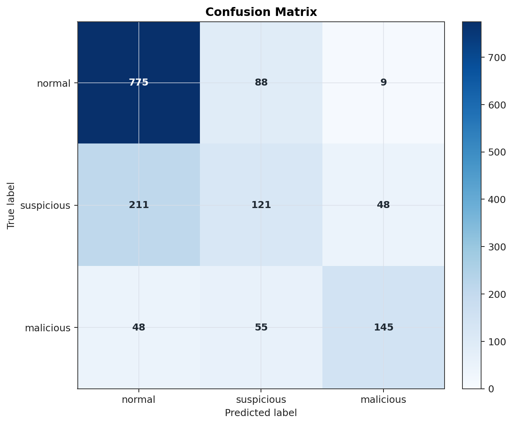
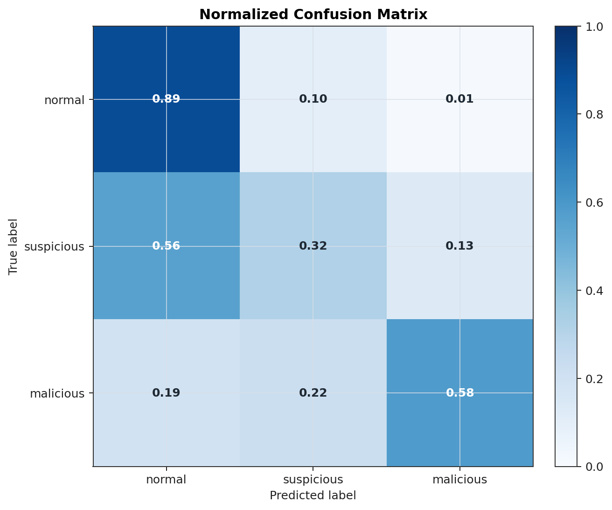
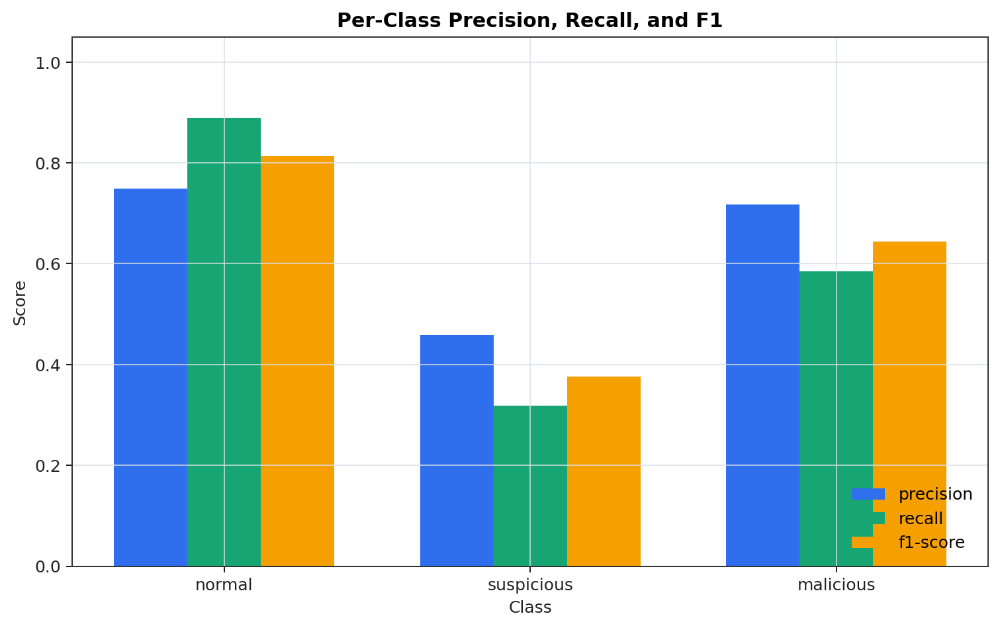
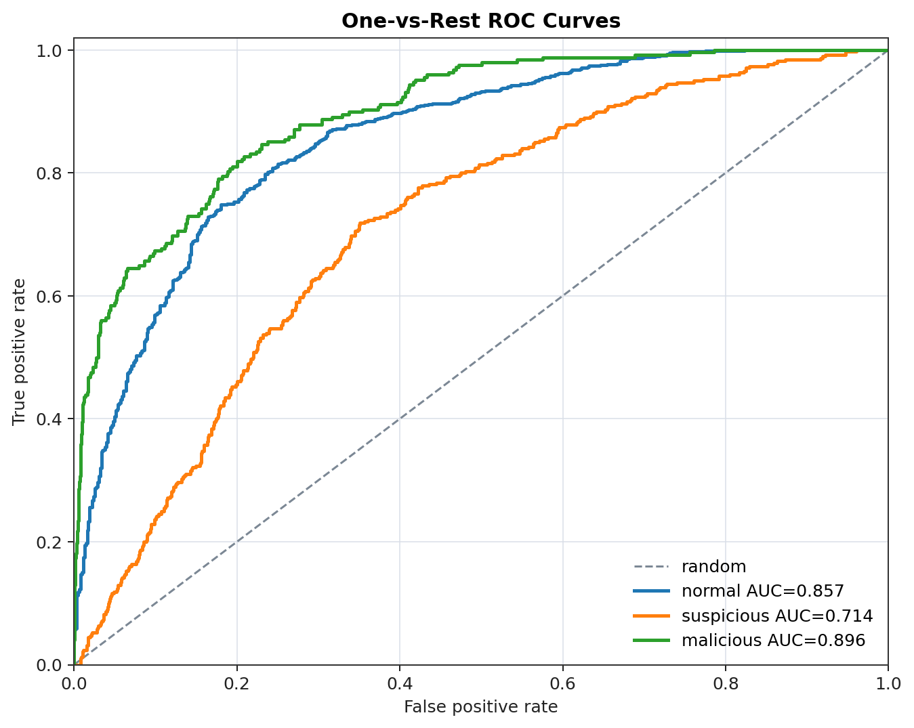
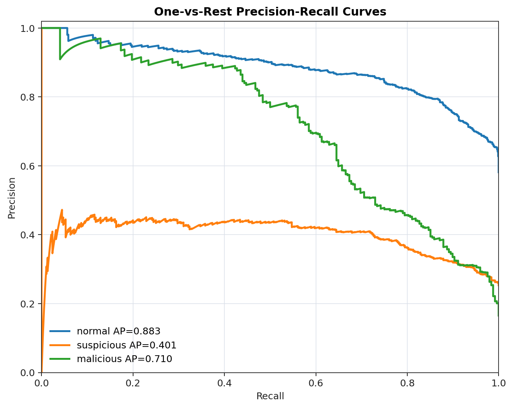
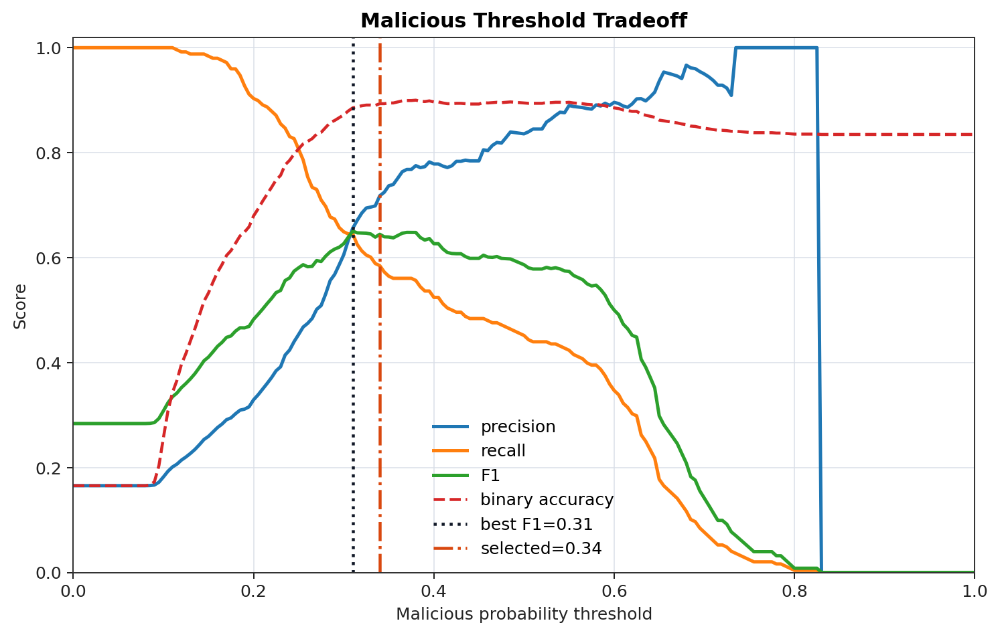
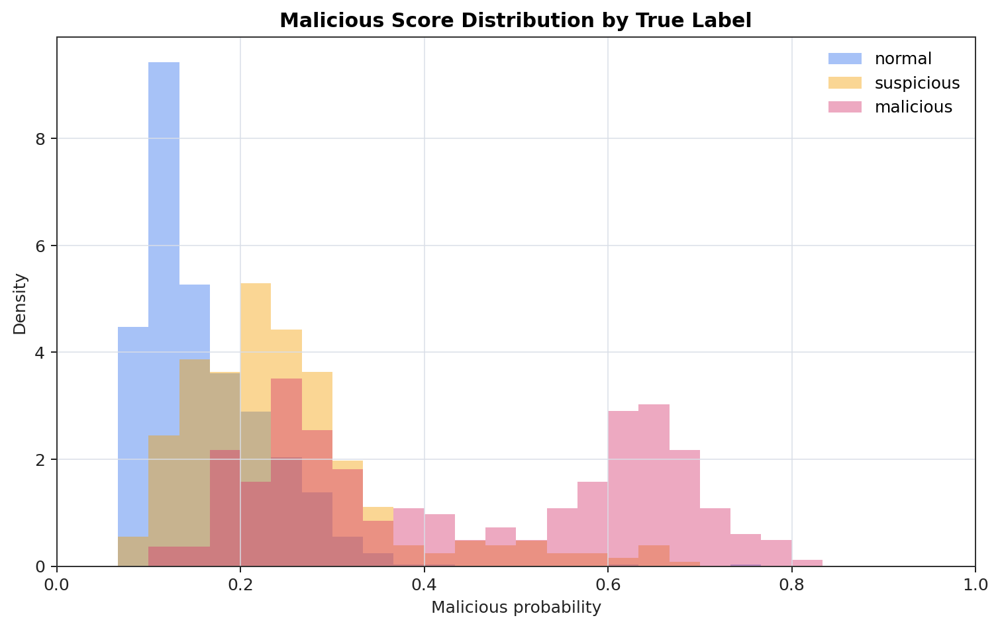
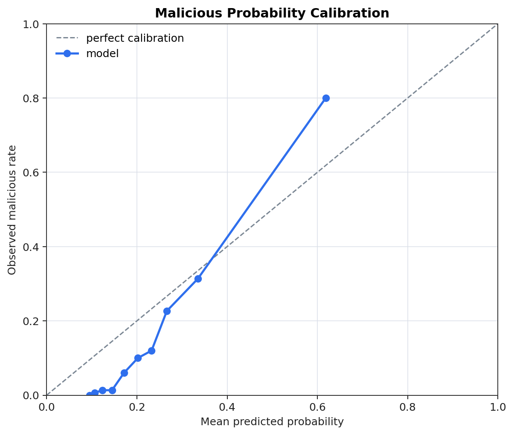
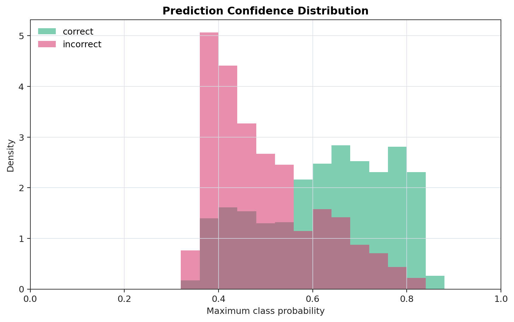

# UPI Interaction Fraud Detection

This project detects interaction-level UPI fraud from message text, URLs, QR payloads, device state, and behavioral session data. The current codebase is centered on `main.py`, which orchestrates training, finalization, evaluation, graph export, and inference for the runtime artifacts in `models/interaction`.

The finalized detector combines a transformer text model, XGBoost structured scoring, and Isolation Forest anomaly scoring into calibrated `normal`, `suspicious`, and `malicious` predictions.

## Project Layout

```text
main.py                         # CLI orchestrator for train/evaluate/infer/plot commands
train_fraud_system.py           # Backward-compatible training shim
fraud_system/                   # Hybrid runtime detector and pipeline internals
src/interaction/                # Data prep, training, evaluation, XAI, and visualization modules
interaction_data/               # Supplied raw and encoded interaction datasets
models/interaction/             # Finalized runtime model, tokenizer, metadata, and reports
models/xgboost_model.pkl        # Team compatibility artifact
models/scaler.pkl               # Team compatibility artifact
outputs/evaluation_graphs/      # GitHub-rendered evaluation graph PNGs
```

## Setup

```powershell
.\.venv\Scripts\python.exe -m pip install -r requirements.txt
```

Use the project virtual environment when available:

```powershell
.\.venv\Scripts\python.exe main.py --help
```

## Single Inference

```powershell
.\.venv\Scripts\python.exe main.py infer `
  --input-text "Urgent UPI verification needed now" `
  --url "http://secure-kyc-update.in/verify-now?ref=upi"
```

The response contains:

- `predicted_label`: `normal`, `suspicious`, or `malicious`
- `risk_level`: `LOW`, `MEDIUM`, or `HIGH`
- `fraud_probability`
- per-class probabilities
- short feature explanations

## Batch Inference

The batch path supports online-style columns such as `input_text`, `url`, and `qr_data`. It also supports the supplied raw interaction dataset shape with columns such as `event_sequence`, `event_timestamps`, `device_state`, and `behavioral_features`.

```powershell
.\.venv\Scripts\python.exe main.py infer `
  --input-file interaction_data\dataset_v2.csv `
  --output-path outputs\predictions.csv
```

Batch outputs include:

- `session_id`
- `interaction_label`
- `interaction_risk_score`
- `interaction_risk_level`
- `normal_probability`
- `suspicious_probability`
- `malicious_probability`
- `true_label` when available
- `source_split`
- `scenario_family`

## Evaluate

```powershell
.\.venv\Scripts\python.exe main.py evaluate --split test_ood
```

Latest finalized `test_ood` evaluation:

```text
rows: 1500
accuracy: 0.6940
macro_f1: 0.6111
weighted_f1: 0.6745
malicious_precision: 0.7178
malicious_recall: 0.5847
malicious_f1: 0.6444
roc_auc: 0.8965
```

Outputs are written to:

```text
outputs/metrics.json
outputs/predictions.csv
```

## GitHub Evaluation Graphs

Generate or refresh the model-evaluation graph bundle:

```powershell
.\.venv\Scripts\python.exe main.py plot-evaluation `
  --predictions-path outputs\predictions.csv `
  --output-dir outputs\evaluation_graphs
```

The PNG graphs in `outputs/evaluation_graphs/` are intentionally allowed through `.gitignore` so they can be committed and rendered by GitHub. Other runtime files under `outputs/` remain ignored.

| Graph | Preview |
| --- | --- |
| Confusion matrix |  |
| Normalized confusion matrix |  |
| Per-class metrics |  |
| ROC curves |  |
| Precision-recall curves |  |
| Malicious threshold tradeoff |  |
| Malicious score distribution |  |
| Malicious calibration |  |
| Confidence distribution |  |

## Training And Finalization

Quick smoke training:

```powershell
.\.venv\Scripts\python.exe main.py train --quick --epochs 1 --train-batch-size 8 --eval-batch-size 16
```

Full train, finalize, and evaluate path:

```powershell
.\.venv\Scripts\python.exe main.py train-full-pipeline `
  --data-dir interaction_data `
  --model-dir models\interaction `
  --output-dir outputs
```

Component-level commands are also available when you want to rerun only part of the pipeline:

```powershell
.\.venv\Scripts\python.exe main.py train-transformer
.\.venv\Scripts\python.exe main.py build-feature-matrices
.\.venv\Scripts\python.exe main.py train-xgboost
.\.venv\Scripts\python.exe main.py train-isolation-forest
.\.venv\Scripts\python.exe main.py train-ensemble
.\.venv\Scripts\python.exe main.py finalize-models
.\.venv\Scripts\python.exe main.py evaluate-system
```

Backward-compatible shim:

```powershell
.\.venv\Scripts\python.exe train_fraud_system.py --quick
```

## Runtime Configuration

The finalized runtime uses calibrated thresholds selected on the validation split:

```text
transformer_model_name: distilbert-base-uncased
ensemble_weights: transformer=0.35, xgboost=0.55, anomaly=0.10
malicious_threshold: 0.34
suspicious_threshold: 0.35
max_length: 96
```

Important project reports:

```text
models/interaction/final_project_report.json
models/interaction/runtime_calibration_report.json
models/interaction/evaluation_report.json
models/interaction/ensemble_report.json
models/interaction/xgboost_tuning_report.json
models/interaction/isolation_forest_report.json
models/interaction/transformer/training_report.json
```

## Public Python API

```python
from src.interaction import detect_fraud, predict_interaction_risk

result = detect_fraud(
    input_text="Urgent UPI verification needed now",
    url="http://secure-kyc-update.in/verify-now?ref=upi",
    qr_data="",
)
```

Available API functions:

- `train_interaction_model(config: dict) -> dict`
- `load_interaction_model(model_dir: str) -> object`
- `predict_interaction_risk(df_or_inputs, model_dir: str) -> pandas.DataFrame`
- `detect_fraud(input_text, url, qr_data, device_info, model_dir="models/interaction") -> dict`
- `evaluate_interaction_model(config: dict) -> dict`
- `evaluate_fraud_detection_system(config: dict) -> dict`
- `export_evaluation_graphs(config: dict) -> dict`
- `finalize_trained_fraud_models(config: dict) -> dict`
