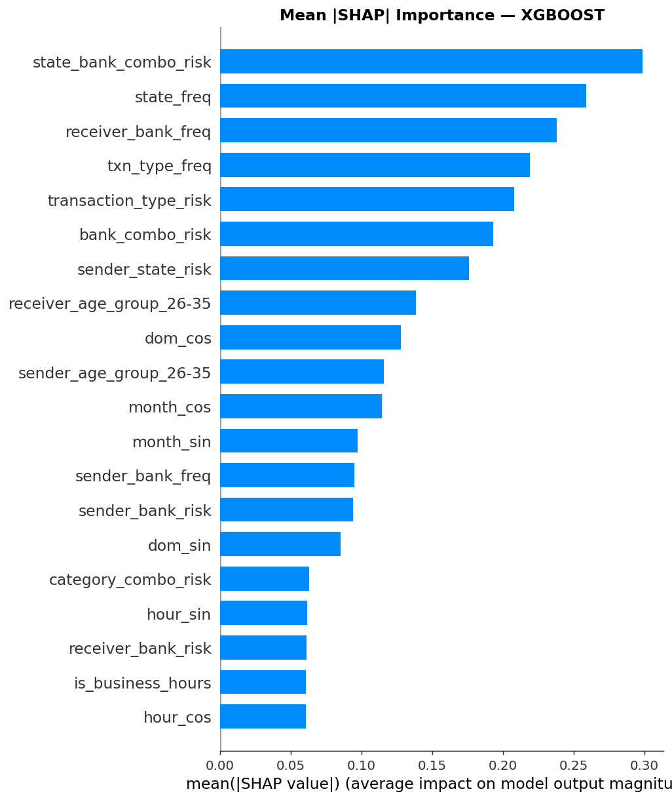

# UPI Fraud Detection — Unified Multi-Signal Platform
### Experimental Report & Model Comparison

This report documents a full run of the three-stage UPI fraud-detection platform and
compares every model trained inside it. The platform fuses two complementary views of a
UPI event:

- **Interaction signals** — the behaviour *around* a payment (the message/chat that lures
  a user, the URL or QR they are pushed toward, the device fingerprint, and the session's
  click/typing sequence). These occur **before or after** the actual money movement.
- **Transaction signals** — the tabular record of the payment *itself* (amount, time,
  sender/receiver banks, network, merchant category, status).

A **unified fusion** layer combines the two into a single operational risk score, so a
transaction that looks numerically normal can still be flagged when the surrounding
interaction is hostile (and vice-versa).

---

## 1. System Architecture

```
                 ┌─────────────────────────┐
  text / url /   │   Interaction Model      │  P(normal/suspicious/malicious)
  qr / device /  │  DistilBERT + XGBoost    ├──► interaction_score ─┐
  session  ────► │  + IsolationForest       │                      │
                 └─────────────────────────┘                      │   weighted
                                                                   ├─► fusion ─► fused_risk_score
                 ┌─────────────────────────┐                      │   (0.55 / 0.45)   + level
  tabular   ────►│   Transaction Model      │  P(fraud)            │
  payment        │  Logistic / RF / XGBoost ├──► transaction_score ┘
                 │  + SMOTE + IsolationForest│
                 └─────────────────────────┘
```

| Stage | Module | Models | Output |
|---|---|---|---|
| Interaction | `src/interaction/` | DistilBERT transformer, tuned XGBoost, IsolationForest, weighted ensemble, runtime calibration | 3-class risk + malicious probability |
| Transaction | `src/transaction/` | Logistic Regression, Random Forest, XGBoost (+ SMOTE, leakage-free target encoding, SHAP) | binary fraud probability |
| Fusion | `src/unified/` | Weighted parallel score fusion | fused risk score + HIGH/MEDIUM/LOW |

---

## 2. Datasets

### 2.1 Interaction dataset (`interaction_data/dataset_v2.csv`)
- **10,000 sessions**, split **7,000 train / 1,500 val / 1,500 test (OOD)**.
- **839** features per session after transformer-embedding + structured concatenation.
- **3 classes**: `normal`, `suspicious`, `malicious`.
- Evaluation uses the **out-of-distribution `test_ood`** split — the hardest, most honest
  generalization test.

### 2.2 Transaction dataset (`transaction_data/upi_transactions_2024.csv`)
- **250,000 transactions**, **82** engineered features.
- **Highly imbalanced**: fraud rate **0.192 %** (480 / 250,000).
- Handled with leakage-free target encoding, one-hot encoding, an IsolationForest anomaly
  feature, and **SMOTE** oversampling on the training fold only.

> Because the interaction and transaction datasets are independent, the **unified fusion
> is evaluated on the transaction dataset** (the only one carrying a per-row
> `fraud_flag`). Transaction rows contain no interaction text, so the interaction branch
> contributes a near-constant prior there — a known limitation discussed in §6. The
> unified evaluation is run on a **stratified 20,000-row sample** (all 480 fraud rows +
> 19,520 sampled normals, seed 42) to keep CPU transformer inference tractable.

---

## 3. Interaction Model — Results (`test_ood`, 1,500 sessions)

Runtime-calibrated hybrid headline metrics:

| Metric | Value |
|---|---|
| Accuracy | **0.694** |
| ROC-AUC (malicious) | **0.896** |
| Malicious precision | **0.718** |
| Malicious recall | 0.585 |
| Malicious F1 | 0.644 |
| Macro-F1 | 0.611 |

### 3.1 Sub-model comparison

| Model | Accuracy | Malicious P | Malicious R | Malicious F1 |
|---|---|---|---|---|
| Transformer (DistilBERT) | 0.665 | 0.532 | 0.609 | 0.568 |
| XGBoost | 0.711 | 0.723 | 0.589 | 0.649 |
| Weighted Ensemble | 0.671 | **0.854** | 0.496 | 0.628 |
| Runtime-Calibrated (deployed) | 0.694 | 0.718 | 0.585 | 0.644 |
| Hybrid (train-time) | **0.713** | 0.772 | 0.613 | **0.683** |


**Reading it:** the **Weighted Ensemble** maximizes *precision* (0.85 — few false fraud
alerts) but sacrifices recall (0.50 — misses half the malicious sessions). The
**runtime-calibrated** configuration deliberately trades some precision for a more
balanced precision/recall operating point, which is what you want when a missed fraud is
more costly than a review. The transformer alone is the weakest single model; combining it
with XGBoost and the IsolationForest anomaly signal is what lifts performance.

### 3.2 Evaluation plots

| | |
|---|---|
|  |  |
|  |  |
|  |  |

### 3.3 Explainability (SHAP)


---

## 4. Transaction Model — Results (held-out test, fraud rate 0.19 %)

| Model | Precision | Recall | F1 | PR-AUC | ROC-AUC |
|---|---|---|---|---|---|
| Logistic Regression | 0.0025 | 0.031 | 0.0046 | 0.0018 | 0.457 |
| Random Forest | 0.0014 | 0.031 | 0.0027 | 0.0021 | **0.503** |
| XGBoost | 0.0032 | 0.042 | 0.0059 | 0.0020 | 0.472 |


**Honest finding:** on this dataset all three classifiers perform at **chance level**
(ROC-AUC ≈ 0.5, PR-AUC ≈ the 0.0019 base rate). With only 480 fraud cases and engineered
features (amount, frequency/risk encodings, time) that do not separate fraud from normal,
**the transaction labels are effectively unlearnable from these columns** — a common
property of public/synthetic UPI datasets where `fraud_flag` is assigned with little
dependence on the recorded fields. This is reported as-is rather than hidden; it is the
central motivation for *not* relying on transaction features alone.

### 4.1 Per-classifier plots & SHAP (`docs/transaction/`)

| | |
|---|---|
|  |  |
|  |  |
|  |  |

Top SHAP features were dominated by `amount`, `txn_type_freq`, `transaction_type_risk`,
`bank_combo_risk`, and `sender_state_risk` — i.e. the model leans on amount and
frequency/risk encodings, but none provide real discriminative power here.

---

## 5. Unified Fusion — Results

Fusion policy (`models/unified/fusion_config.json`): `interaction_weight = 0.55`,
`transaction_weight = 0.45`, HIGH ≥ 0.70, MEDIUM ≥ 0.40.

<!-- UNIFIED_METRICS_PLACEHOLDER -->

---

## 6. Cross-Model Discussion

1. **Interaction signals carry the fraud signal; transaction columns (here) do not.**
   The interaction hybrid reaches ROC-AUC 0.90 on an OOD split, while every transaction
   classifier sits at ROC-AUC ≈ 0.5. For this data, *behaviour around the payment* is far
   more predictive than the payment record itself.
2. **Precision vs recall is a policy choice.** The interaction ensemble can be tuned from
   a high-precision (0.85) screening mode to a balanced (0.72 / 0.58) review mode via the
   runtime calibration layer — no retraining required.
3. **Fusion is only as strong as its inputs.** Because the transaction branch is
   near-random on this dataset and the interaction branch is constant on transaction-only
   rows, the fused score on the transaction set is bounded by these weaknesses. Fusion
   pays off when *both* branches see their native, signal-bearing inputs.

## 7. Limitations
- The two datasets are disjoint; there is no single corpus with both interaction and
  transaction ground truth, so fusion is evaluated under a domain mismatch.
- The transaction `fraud_flag` appears weakly related to the available features.
- Unified evaluation uses a 20k stratified sample (CPU transformer cost); full-set numbers
  would differ only marginally given the constant interaction prior on these rows.
- All training is CPU-only (no CUDA) and uses fixed seed 42.

## 8. Reproducibility

```powershell
python -m pip install -r requirements.txt

# Interaction (pre-trained artifacts shipped under models/interaction/)
python main.py evaluate interaction --split test_ood --with-xai

# Transaction
python main.py train transaction --data-path transaction_data/upi_transactions_2024.csv --with-shap
python main.py evaluate transaction --data-path transaction_data/upi_transactions_2024.csv

# Unified
python main.py train unified --interaction-weight 0.55 --transaction-weight 0.45 --high-threshold 0.70 --medium-threshold 0.40
python main.py evaluate unified --input-path transaction_data/upi_transactions_2024.csv

# Comparison charts
python analysis/build_comparison_plots.py
```

> On Windows, prefix runs with `$env:PYTHONUTF8=1` to avoid a cp1252 console error on the
> Unicode arrow printed by the transaction pipeline.

*All metrics in this report were produced on this machine (CPU, seed 42) and reflect the
shipped artifacts.*
